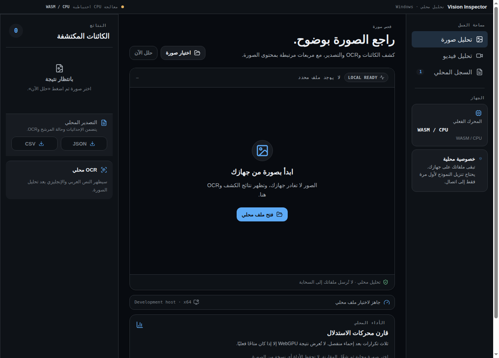
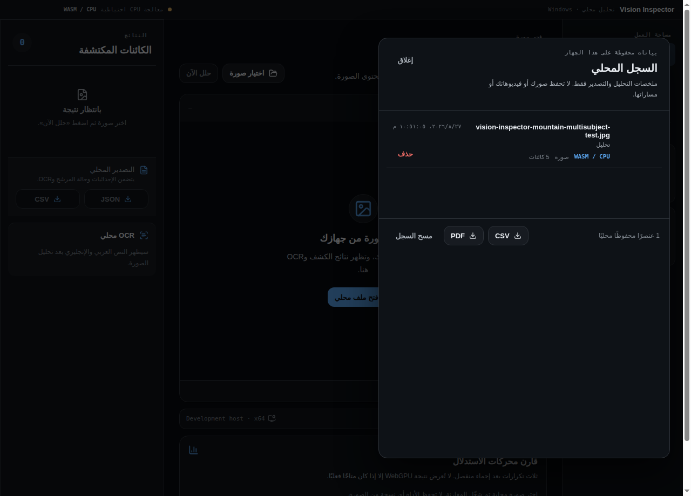

# Vision Inspector Local AI

**Vision Inspector Local AI** is an Arabic-first, right-to-left visual-analysis workspace for the web and Windows. It supports image object detection, OCR, interactive bounding boxes, structured JSON/CSV export, and local video object tracking while leaving the original video audio available to the user.

> The application is designed around local processing. Uploaded images, video frames, OCR results, detection boxes, tracking data, and exports stay on the device. The web server only provides a constrained model-download proxy. The Windows version accesses files through a native selection dialog and downloads public model artifacts only when they are missing from the local cache.

## Screenshots

| Windows Classic Dark — initial state | Windows local-history sharing |
| --- | --- |
|  |  |

The screenshots come directly from the Electron window and deliberately show only verified interface states. They do not present a sample detection as a proof of universal accuracy; all detections remain model predictions with confidence and tentative-state semantics described below.

## Capabilities

| Capability | Implementation |
| --- | --- |
| Image object detection | `Xenova/yolos-tiny` through Transformers.js, using WebGPU when available and WASM otherwise. |
| Small and distant objects | A local multi-scale detail pass reviews overlapping image regions when the overview finds few objects. |
| Open-vocabulary candidates | Local Grounding DINO pass for bird, turtle, and building candidates when the overview is sparse. Low-confidence results are explicitly marked as **tentative**. |
| OCR | Arabic and English OCR with bundled Tesseract.js worker/core and `eng`/`ara` language data, including confidence and word coordinates. |
| Image inspection | Accurate `object-fit: contain` box layout, pan/zoom, focusable detections, and real image-region thumbnails. |
| Result export | JSON and CSV downloads, including bounding boxes, OCR, model source, and `candidateLabel`/`tentative` fields where relevant. |
| Video tracking | Local periodic frame analysis, IoU plus centre-proximity track matching, stable track IDs, and a canvas overlay above a native video player. |
| Windows desktop | Electron desktop workspace with native file/save dialogs, local `vision-media://` file session protocol, device diagnostics, bundled ONNX Runtime/OCR assets, and a WebGPU-to-WASM/CPU inference fallback. The ForgeSight Classic Dark interface uses a restrained Windows-first dark palette and avoids decorative AI icons and emoji. |
| Local performance meter | Optional, on-demand benchmark with separate model warm-up and three inference passes. It reports a median for WASM/CPU and adds WebGPU only after an adapter is confirmed. |
| Local history | Persisted analysis and export summaries with local review, individual deletion, and clear-all control. It excludes original media bytes and absolute media paths. The visible summaries can be shared on demand as BOM-encoded CSV or a self-contained landscape A4 PDF through a native save dialog. |

## Quick start

### Prerequisites

- Node.js 22 or later.
- pnpm 9 or later.
- A modern Chromium-based browser is recommended. WebGPU can improve inference speed; the app falls back to WASM when it is unavailable.

### Run the Windows desktop app from source

| Requirement | Notes |
| --- | --- |
| Operating system | Windows 10/11 x64 is the packaged-app target. The source UI can be developed on other Electron-supported systems. |
| Runtime | Node.js 22 and pnpm 10. |
| GPU | Optional. The app uses WebGPU only when an adapter is available and reports the engine used. Otherwise it uses local WASM/CPU. |
| Storage | Free space is needed for the installer and the first downloaded vision-model cache. ONNX Runtime and Tesseract OCR resources are bundled; YOLOS and Grounding DINO weights download from their public repositories only when missing from the local cache. |

```bash
pnpm install
pnpm desktop:dev
```

For a production installer on Windows:

```bash
pnpm desktop:pack:win
```

The installer is written to `release/`. For normal users, download the latest EXE and `SHA256SUMS.txt` from [GitHub Releases](https://github.com/mohammed18salah/vision-inspector-local-ai/releases), verify the checksum, and then run the installer. The workflow can sign a future build when the repository owner adds a trusted PFX certificate as protected GitHub Actions secrets; until then, releases are explicitly unsigned and Windows SmartScreen can warn.

### Install and run

```bash
pnpm install
pnpm dev
```

Open the URL printed by Vite. Select **تحليل صورة** for image inspection or **تحليل فيديو** for video tracking. The first analysis can take longer because the browser downloads and caches the selected local model.

### Validation commands

```bash
pnpm test
pnpm check
pnpm build
pnpm desktop:check
pnpm desktop:build
```

## Architecture

```text
Browser
├── React RTL workspace
├── Transformers.js: YOLOS + Grounding DINO
├── Tesseract.js OCR
├── Canvas overlays, pan/zoom, and video frame extraction
└── JSON/CSV export

Express server
└── Allow-listed /api/model proxy for public model downloads only

Windows desktop
├── Electron main process: native dialogs, device diagnostics, and atomic local history store
├── Preload bridge: allow-listed IPC only, context isolation enabled
├── React ForgeSight Classic Dark workspace with performance meter and history panel
├── Bundled ONNX Runtime WASM and Tesseract worker/core/language data
└── Local WebGPU when available → local WASM/CPU fallback
```

The proxy only allows downloads from `Xenova/yolos-tiny` and `onnx-community/grounding-dino-tiny-ONNX`. It does not receive a user’s uploaded image or video data.

## Accuracy and confidence

Computer-vision detections are model predictions, not guaranteed facts. Small, blurred, distant, occluded, or unusual objects may be missed. The interface distinguishes normal detections from low-confidence open-vocabulary candidates, displayed as **مرشح** and exported with `tentative: true` and `candidateLabel`.

For best results, use well-lit source material with the object occupying a meaningful part of the frame. Video tracking rate is configurable, trading processing load for temporal detail.

## Privacy

Images, video frames, inference outputs, OCR, and exports stay in the browser or in the desktop application on the same device. The desktop history store keeps only compact analysis/export summaries such as a file-name leaf, engine, counts, time, export type, and checksum; it never stores the original media bytes or an absolute media path. CSV and PDF history exports contain the same summaries only, and are written after the user chooses a location in the native dialog. The web runtime now serves ONNX Runtime, the OCR worker, and OCR language data from the same application origin, so a blocked public CDN does not prevent local analysis from starting. Model weights still download from the public allow-listed model source on their first use when absent from cache; user media is never sent there. Detection output is a model prediction, not a guarantee that every object in every image has been found. See [SECURITY.md](./SECURITY.md) for the desktop bridge and distribution model.

## Licenses and model notices

The source code in this repository is licensed under [Apache License 2.0](./LICENSE). Third-party packages and model weights are **not** relicensed by this repository; they remain subject to their respective terms. Review the upstream model cards before redistribution or production use:

- [Xenova/yolos-tiny](https://huggingface.co/Xenova/yolos-tiny)
- [onnx-community/grounding-dino-tiny-ONNX](https://huggingface.co/onnx-community/grounding-dino-tiny-ONNX)
- [Transformers.js](https://github.com/huggingface/transformers.js)
- [Tesseract.js](https://github.com/naptha/tesseract.js)

See [NOTICE](./NOTICE) for the repository-level attribution notice.

## Repository layout

```text
client/             React application and RTL interface
server/             Express runtime and constrained model proxy
scripts/            Reproducible browser and model validation scripts
drizzle/            Database schema scaffold from the full-stack template
shared/             Shared types, constants, and pure vision-core functions used by web and Windows
desktop/            Electron main process, preload bridge, and ForgeSight Windows UI
design-system-forgesight-windows/  Tokens, CSS, specification, and visual design-system preview
docs/screenshots/    Real web and desktop screenshots used above
```

## Contributing

Contributions are welcome. Please keep changes Arabic-first and RTL-aware, preserve the local-processing model, add or update tests for functional behavior, and run `pnpm test && pnpm check && pnpm build && pnpm desktop:check && pnpm desktop:build` before opening a pull request.
